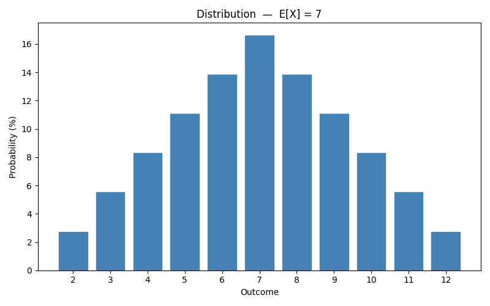
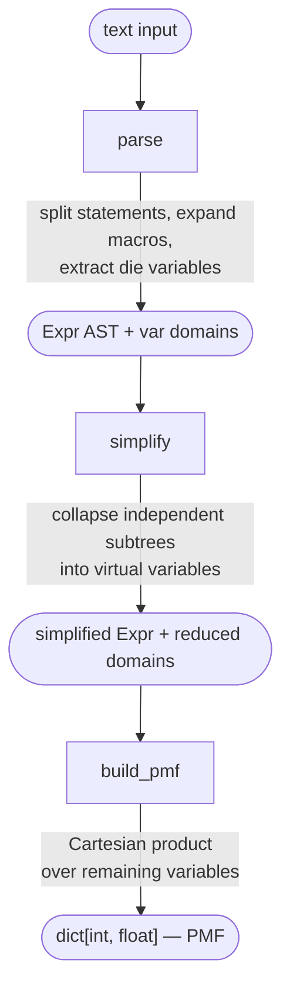
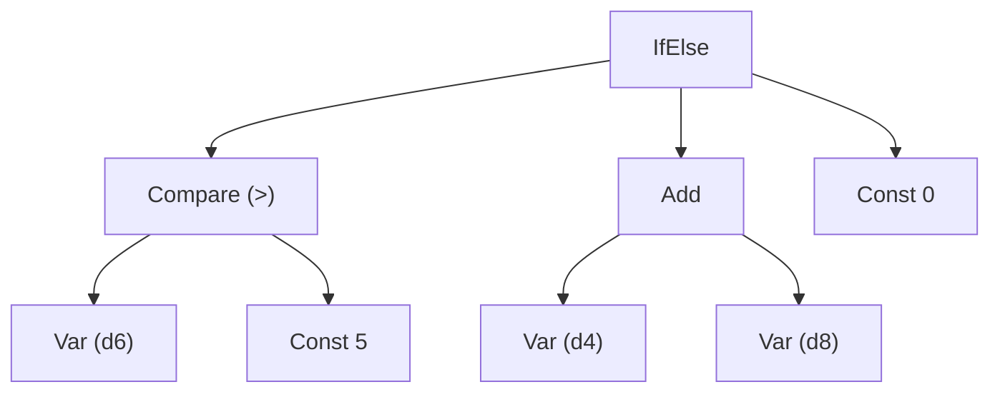
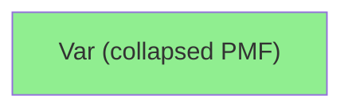
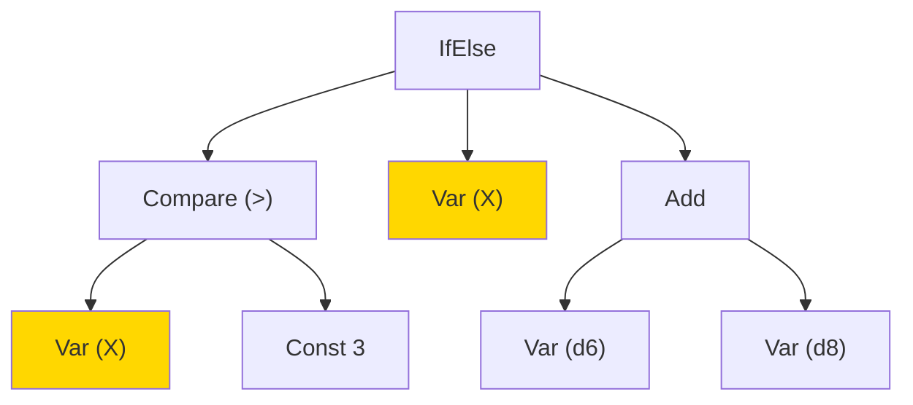
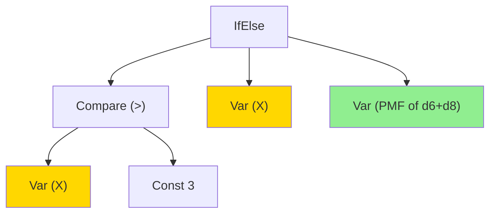

# Dice Probabilities

When one die affects what another contributes, standard probability tables break down. This tool handles those cases exactly — write any expression over named dice rolls, and get back the full distribution. No sampling, no approximation.

```text
f(X, Y): X + Y > 6 -> 2*X | X - Y
f(d6, d6)
```

Roll two d6s — if their sum exceeds 6, score double the first die; otherwise the difference:

```text
-4: 0.56%    -3: 1.39%    -2: 2.50%    ...
 8: 2.78%    10: 5.56%    12: 2.78%
Expected Value: 3.78
```

Every possible combination of rolls is considered; the result is always exact, never sampled.

## Output modes

**Default** — one line per outcome sorted ascending, then the expected value:

```text
0: 50.00%
4: 16.67%
5: 16.67%
6: 16.67%
Expected Value: 2.5
```

**`--render ascii`** — horizontal bar chart scaled to the modal outcome:

```text
python -m dice "d6 + d6" --render ascii
```

```text
 2 |█████                           2.78%
 3 |██████████                      5.56%
 4 |███████████████                 8.33%
 5 |████████████████████           11.11%
 6 |█████████████████████████      13.89%
 7 |██████████████████████████████ 16.67%
 8 |█████████████████████████      13.89%
 9 |████████████████████           11.11%
10 |███████████████                 8.33%
11 |██████████                      5.56%
12 |█████                           2.78%
```

**`--render mat`** — matplotlib bar chart (requires `pip install -e ".[plot]"`):

```bash
python -m dice "d6 + d6" --render mat
```



---

## Architecture

The evaluator is built as a pipeline:



### How function expansion works

Function calls are resolved at parse time by macro substitution — the engine never sees them. When `f(d6)` is called:

1. The `d6` argument is extracted to a fresh variable **before** substitution, so every occurrence of the parameter in the body refers to the same roll.
2. The body is substituted with `param → var`.
3. Any `dN` tokens inside the body become fresh variables at this point.
4. The result is expanded recursively for nested calls.

This guarantees that `double(X): X + X; double(d6)` produces `{2,4,6,8,10,12}` each with P=1/6 (one roll, doubled) — not the distribution of two independent dice.

### Modules

| Module         | Responsibility                                                                          |
| -------------- | --------------------------------------------------------------------------------------- |
| `ast_nodes.py` | Frozen dataclass AST nodes for all expression types                                     |
| `evaluator.py` | `eval_expr(expr, env)` — pure evaluation given a concrete variable assignment           |
| `engine.py`    | `build_pmf(expr, domains)` — joint enumeration over all variable assignments            |
| `simplify.py`  | `simplify(expr, domains)` — AST simplification pass; collapses independent subtrees     |
| `parser.py`    | Recursive-descent parser, macro expansion, die extraction; `parse()` and `parse_expr()` |
| `cli.py`       | Command-line interface                                                                  |

### How simplify works

`simplify` walks the AST bottom-up, threading a `forbidden` variable set top-down. It collapses any subtree whose variables are entirely disjoint from both its sibling's variables and the `forbidden` context. Collapsed subtrees are replaced by a single virtual variable (`_v0`, `_v1`, …) whose domain is the pre-computed PMF.

**The `forbidden` context.** Each recursive call carries the union of variable sets of all sibling subtrees at every ancestor level. This prevents a subtle bug: in `(X+Y) + (X+Z)`, the left child `X+Y` has disjoint internal variables and looks self-contained locally, but `X` is also in the right sibling — collapsing `X+Y` into a virtual variable would discard X's correlation with `X+Z`. The forbidden context catches this by including `vars(right)` when descending into `left`, and vice-versa.

**Binary nodes.** For `BinOp(left, right)`:

1. Read `left_vars` and `right_vars` from the pre-annotation snapshot.
2. Recurse into each child, passing the other child's original vars (plus the outer `forbidden`) as the new forbidden set.
3. Collapse if `left_vars ∩ right_vars = ∅` and `(left_vars ∪ right_vars) ∩ forbidden = ∅`.
4. If collapsing: compute each child's PMF, combine them with the operator-specific function, register the result as a new virtual variable, and remove the consumed originals from the domain map.

**PMF combination per operator:**

| Node      | Combination                                     |
| --------- | ----------------------------------------------- |
| `Add`     | pairwise `a + b` over joint distribution        |
| `Sub`     | pairwise `a - b`                                |
| `Mul`     | pairwise `a * b`                                |
| `Compare` | pairwise `int(op(a, b))`                        |
| `And`     | `P(A != 0) * P(B != 0)`                         |
| `Or`      | `1 - P(A == 0) * P(B == 0)`                     |
| `IfElse`  | `p_true * PMF(then) + (1 - p_true) * PMF(else)` |

The pairwise combination (used for arithmetic and comparisons) is a double loop over outcomes — `O(|A| × |B|)` — not Cartesian enumeration. For `n` independent dice this is `O(n · k²)` total, versus `O(kⁿ)` for full enumeration.

**`IfElse` nodes.** The collapse condition is slightly different: the condition subtree must be independent of *both* branches (`cond_vars ∩ (then_vars ∪ else_vars) = ∅`). When true, the condition's PMF is computed, `p_true = Σ P(condition≠0)` is extracted, and the result PMF is `p_true · PMF(then) + (1−p_true) · PMF(else)`. This is the case that makes `d6 > 5 -> 50d20 | 0` fast: the d6 and all 50 d20s are independent, so the entire expression collapses to a single virtual variable.

**Result.** After simplification, `build_pmf` sees only the variables that are genuinely entangled with each other. For most game-table expressions this is zero or one variable remaining.

#### Example: full collapse — `d6 > 5 -> d4 + d8 | 0`

The condition die and all branch dice are fully independent. The entire expression collapses to a single virtual variable.

**Before `simplify`:**



**After `simplify`:**



#### Example: partial collapse — `f(X): X > 3 -> X | d6 + d8;  f(d6)`

`X` appears in both the condition and the then-branch, so the `IfElse` node cannot be collapsed. The else-branch dice `d6 + d8` are independent of everything else and collapse on their own.

**Before `simplify`:**



**After `simplify`:**



Two variables remain: `X` (d6) and the pre-computed PMF of d6+d8. `build_pmf` enumerates only their 6 × 19 = 114 combinations instead of 6 × 6 × 8 = 288.

### How build_pmf works

After expansion, every die in the expression is a distinct named variable with a domain of `(face, probability)` pairs. `build_pmf` takes the Cartesian product of all domains, evaluates the expression for each combination, and accumulates probability into a result map:

```python
for outcome in product(domain_lists):
    variable_values = {name: face for name, (face, _) in zip(variable_names, outcome)}
    joint_probability = product(p for _, p in outcome)
    result[eval_expr(expr, variable_values)] += joint_probability
```

Each outcome is weighted by the product of its individual face probabilities (uniform dice all have p=1/N, so the joint probability is 1/N₁·N₂·…). The result is an exact PMF — no sampling, no floating-point shortcuts.

### Complexity

Exact enumeration is `O(kⁿ)` where `k` is die size and `n` is the number of distinct die variables after expansion. For typical DnD expressions (2–5 dice) this is instant.

---

## Installation

```bash
pip install -e .
pip install -e ".[plot]"   # also install matplotlib for --render mat
```

Requires Python 3.10+.

## Usage

```bash
python -m dice "EXPRESSION"
```

Multi-line programs can be passed as a single quoted string:

```bash
python -m dice "bonus(X): X + d6
attack(X): bonus(X) + bonus(X)
attack(d6)"
```

## Expression Syntax

A program is a sequence of **function definitions** followed by exactly one **expression** to evaluate. Statements are separated by newlines or `;`.

```
name(param, ...): expr
name(param, ...): expr
final_expr
```

### Function definitions

```
threshold(X): X > 3 -> X | 0
add(X, Y): X + Y
combo(X, Y): threshold(X) + add(X, Y)
```

Each parameter is bound **once** at the call site. If a parameter appears multiple times in the body, all occurrences see the same roll. Inline dice in function bodies (`dN`) are fresh and independent on every call.

### Final expression

The last statement is the expression to evaluate — a function call or any bare expression:

```
threshold(d6)
add(d6, d4)
d6 + d6
```

### Bare expressions

No function definitions are required. Inline dice work directly:

```bash
python -m dice "d6 + d6"
python -m dice "d6 > 3 -> d4 | 0"
```

Each `dN` occurrence is an independent roll. To reuse the same roll, bind it to a parameter.

---

## Grammar

```text
program := (definition ";"|"\n")* expr

definition := NAME "(" NAME ("," NAME)* ")" ":" expr

expr    := ifelse
ifelse  := orelse ("->" orelse "|" orelse)?
orelse  := andexpr ("||" andexpr)*
andexpr := compare ("&&" compare)*
compare := add (("<" | ">" | "<=" | ">=" | "==" | "!=") add)?
add     := mul (("+" | "-") mul)*
mul     := atom ("*" atom)*
atom    := INT | NAME | dN | NAME "(" expr ("," expr)* ")" | "(" expr ")"
```

### Operator precedence (tightest to loosest)

| Level       | Operators                   |
| ----------- | --------------------------- |
| Arithmetic  | `*` then `+` `-`            |
| Comparison  | `<` `>` `<=` `>=` `==` `!=` |
| Boolean AND | `&&`                        |
| Boolean OR  | `\|\|`                      |
| Conditional | `cond -> then \| else`      |

Parentheses override precedence at any level.

---

## Syntax Reference

### Dice

| Syntax | Meaning                              |
| ------ | ------------------------------------ |
| `d6`   | A fair six-sided die (faces 1–6)     |
| `d20`  | A fair twenty-sided die (faces 1–20) |
| `dN`   | Any positive integer N               |

### Arithmetic

```
X + Y        # addition
X - Y        # subtraction
X * Y        # multiplication
2*X + 1      # precedence: multiplication before addition
2*(X + 1)    # parentheses override precedence
```

### Comparisons

```
X > 3    X < Y    X >= 3    X <= Y    X == Y    X != 3
```

Results are boolean (0 or 1), usable in conditional tests.

### Boolean operators

```
X > 3 && Y > 3       # both must be true
X > 4 || Y > 4       # at least one must be true
```

`&&` binds tighter than `||`. Both bind tighter than `->`.

### Conditional expression

```
cond -> then | else
```

Evaluates `cond`; if truthy returns `then`, otherwise `else`. Branches can be arbitrary expressions including nested conditionals (wrap inner ones in parentheses):

```
X > 3 -> (Y > 3 -> X*Y | X) | Y
```


---

## Extending the language

Two design documents in [documentation/](documentation/) show how to add new language features:

- [adding-a-parser-feature.md](documentation/adding-a-parser-feature.md) — a `match` expression that desugars to `IfElse` inside `_extract_dice`. The new syntax exists only during parsing; the evaluator, engine, and simplify pass see no new nodes.
- [adding-a-binary-operator.md](documentation/adding-a-binary-operator.md) — `min`/`max` operators and `adv`/`dis` advantage sugar. `Min`/`Max` are permanent `BinaryNode` subclasses that flow through the full pipeline. The `BinaryNode.apply` protocol means no new code is needed in the evaluator, engine, or simplify pass.

---

## Known Limitations

- Functions must be defined before use (top-to-bottom only)
- No recursion (detected and rejected at parse time)
- Exponential blow-up in the number of interdependent dice: `build_pmf` enumerates the full Cartesian product of all die variables that could not be simplified, so complexity is `O(kⁿ)` where `n` is the number of distinct dice after expansion.

---

## Running Tests

```bash
pytest tests/ -v
```

418 tests covering: AST nodes, evaluator, engine (PMF axioms, known expected values, symmetry), parser (precedence, all operators, error cases), functions (binding semantics, independence, composition, error cases), scalability stress tests, AST simplification, integration (full pipeline, property checks, CLI output), and extreme multi-variable cases.
